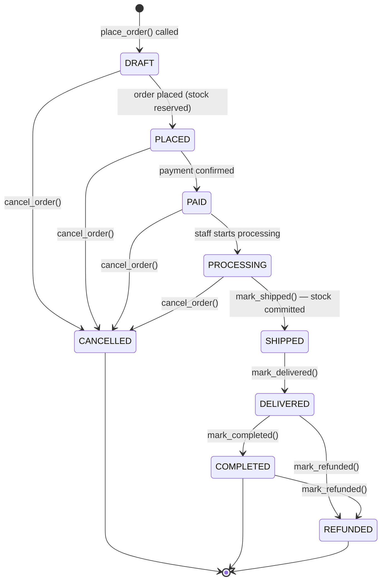

# Aurora Blings — Order System Walkthrough

## State Machine



## Cart → Order Conversion Flow

```
POST /api/v1/orders/place/
─────────────────────────────────────────────────────────
1. cart.services.validate_cart()
   ├─ Each item: check variant.is_active
   ├─ Each item: check stock availability (non-locking)
   └─ Each item: check is_price_stale
   → If any error: raise ValidationError with detail list

2. For each cart item:
   inventory.services.reserve_stock(
       variant_id, warehouse_id, quantity,
       order_id=<new order UUID>
   )
   → SELECT FOR UPDATE on WarehouseStock
   → Raises InsufficientStockError if available < requested
   → Writes StockLedger(RESERVATION) entry

3. Build Order (status=DRAFT) with:
   ├─ Address snapshots (JSON)
   ├─ Financial totals (subtotal + shipping + tax)
   └─ OrderItem per cart item (price + product snapshot)

4. cart.services.convert_cart() → Cart.status = CONVERTED

5. _apply_transition(DRAFT → PLACED)
   → OrderStatusHistory entry written
   → order.placed_at = now()

Response: full OrderDetailSerializer
```

## Snapshot Strategy

| Field | Snapshot at | Purpose |
|---|---|---|
| `OrderItem.unit_price` | Cart add / update time | What customer was charged |
| `OrderItem.line_total` | Order placement | Immutable order total |
| `OrderItem.product_snapshot` | Order placement | Stable historical record |
| `Order.shipping_address` | Order placement | Address at purchase time |
| `Order.grand_total` | Order placement | Never recalculated |

> **Why snapshots matter:** If a product is renamed, repriced, or deleted after the order is placed, all historical orders still show the correct data.

## Inventory Integration Points

| Order Event | Inventory Call | Effect |
|---|---|---|
| [place_order()](file:///f:/Development/Django/aurorablings/backend/apps/orders/services.py#64-200) | [reserve_stock()](file:///f:/Development/Django/aurorablings/backend/apps/inventory/services.py#108-178) | [available](file:///f:/Development/Django/aurorablings/backend/apps/inventory/selectors.py#77-85) ↓, [StockReservation(ACTIVE)](file:///f:/Development/Django/aurorablings/backend/apps/inventory/models.py#259-317) created |
| [cancel_order()](file:///f:/Development/Django/aurorablings/backend/apps/orders/services.py#230-266) | [release_reservation()](file:///f:/Development/Django/aurorablings/backend/apps/inventory/services.py#184-238) | [available](file:///f:/Development/Django/aurorablings/backend/apps/inventory/selectors.py#77-85) ↑, Reservation → RELEASED |
| [mark_shipped()](file:///f:/Development/Django/aurorablings/backend/apps/orders/services.py#307-345) | [commit_reservation()](file:///f:/Development/Django/aurorablings/backend/apps/inventory/services.py#244-312) | [on_hand](file:///f:/Development/Django/aurorablings/backend/core/exceptions.py#64-129) ↓, Reservation → COMMITTED |
| Return (future) | [process_return()](file:///f:/Development/Django/aurorablings/backend/apps/inventory/services.py#318-378) | [on_hand](file:///f:/Development/Django/aurorablings/backend/core/exceptions.py#64-129) ↑ |

## API Endpoints

### Customer
| Method | URL | Description |
|---|---|---|
| `GET` | `/api/v1/orders/` | My orders list |
| `GET` | `/api/v1/orders/{id}/` | My order detail |
| `POST` | `/api/v1/orders/place/` | Place order from cart |
| `POST` | `/api/v1/orders/{id}/cancel/` | Cancel own order |

### Admin (staff+)
| Method | URL | Description |
|---|---|---|
| `GET` | `/api/v1/orders/admin/` | All orders (filterable) |
| `GET` | `/api/v1/orders/admin/{id}/` | Any order detail |
| `POST` | `/api/v1/orders/admin/{id}/pay/` | Mark paid |
| `POST` | `/api/v1/orders/admin/{id}/ship/` | Mark shipped + tracking |
| `POST` | `/api/v1/orders/admin/{id}/deliver/` | Mark delivered |
| `POST` | `/api/v1/orders/admin/{id}/complete/` | Mark completed |
| `POST` | `/api/v1/orders/admin/{id}/refund/` | Mark refunded |
| `POST` | `/api/v1/orders/admin/{id}/transition/` | Generic transition |

## Order Number Format

`AB-{YEAR}-{NNNNN}` — e.g. `AB-2026-00042`

Generated in `Order.save()` using a year-scoped counter. Unique + indexed.

## Migration command
```bash
python manage.py makemigrations orders
python manage.py migrate
```
