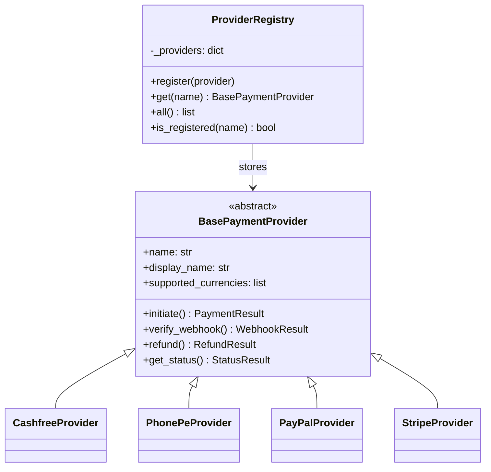
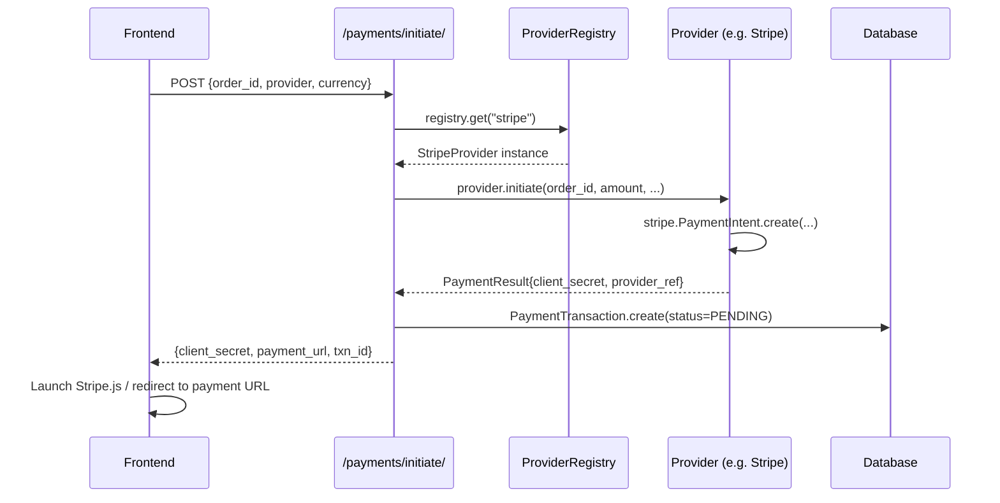
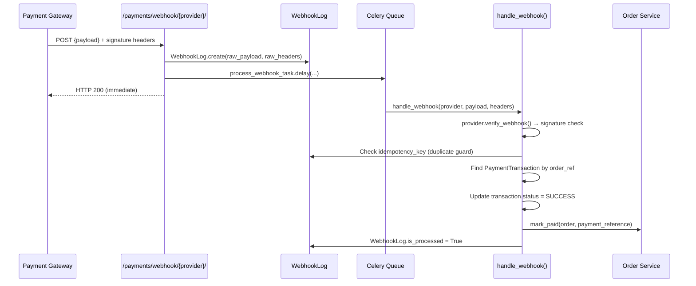

# Aurora Blings — Payment System Walkthrough

## Plugin Architecture



## Payment Initiation Flow



## Webhook Security & Processing Flow



## Webhook Signature Verification

| Provider | Header | Algorithm |
|---|---|---|
| **Cashfree** | `x-webhook-signature` | `HMAC-SHA256(timestamp + payload, secret)` → base64 |
| **PhonePe** | `x-verify` | `SHA256(base64(payload) + endpoint + salt_key)` + `###salt_index` |
| **PayPal** | `paypal-transmission-sig` | Server-side API call to PayPal's verify endpoint |
| **Stripe** | `stripe-signature` | `stripe.Webhook.construct_event(payload, sig, secret)` |

> [!IMPORTANT]
> Webhooks always log the raw payload **before** verification. If verification fails, the log is retained for audit.

> [!WARNING]
> Never parse the webhook payload before verifying the signature — always pass the raw `bytes` to [verify_webhook()](file:///f:/Development/Django/aurorablings/backend/apps/payments/providers/cashfree.py#101-151).

## Retry Strategy

```
Transaction FAILED
       │
       ▼
can_retry? (retry_count < max_retries=3)
       │ YES
       ▼
retry_count += 1
status = RETRY
       │
       ▼ (Celery: retry_failed_payment_task)
initiate_payment() → new PaymentTransaction
       │
       ├─── SUCCESS → mark_paid()
       │
       └─── FAILURE → schedule next retry
                  Attempt 1: +60s
                  Attempt 2: +120s
                  Attempt 3: +240s (max)
                  Gives up → last_error saved
```

## API Endpoints

| Method | URL | Auth | Description |
|---|---|---|---|
| `GET` | `/api/v1/payments/providers/` | Any | List all registered providers |
| `POST` | `/api/v1/payments/initiate/` | JWT | Create payment session |
| `GET` | `/api/v1/payments/status/{txn_id}/` | JWT | Poll transaction status |
| `POST` | `/api/v1/payments/retry/` | JWT | Retry failed transaction |
| `POST` | `/api/v1/payments/refund/` | Staff+ | Issue refund |
| `POST` | `/api/v1/payments/webhook/{provider}/` | None (signature) | Receive webhook |
| `GET` | `/api/v1/payments/admin/transactions/` | Staff+ | All transactions |
| `GET` | `/api/v1/payments/admin/webhooks/` | Staff+ | Webhook audit log |

## Environment Variables Required

```env
# Cashfree
CASHFREE_APP_ID=
CASHFREE_SECRET_KEY=
CASHFREE_ENV=sandbox

# PhonePe
PHONEPE_MERCHANT_ID=
PHONEPE_SALT_KEY=
PHONEPE_SALT_INDEX=1
PHONEPE_ENV=sandbox

# PayPal
PAYPAL_CLIENT_ID=
PAYPAL_CLIENT_SECRET=
PAYPAL_WEBHOOK_ID=
PAYPAL_ENV=sandbox

# Stripe
STRIPE_SECRET_KEY=sk_test_...
STRIPE_PUBLISHABLE_KEY=pk_test_...
STRIPE_WEBHOOK_SECRET=whsec_...

# General
FRONTEND_URL=http://localhost:5173
```

## Migration command
```bash
python manage.py makemigrations payments
python manage.py migrate
```
