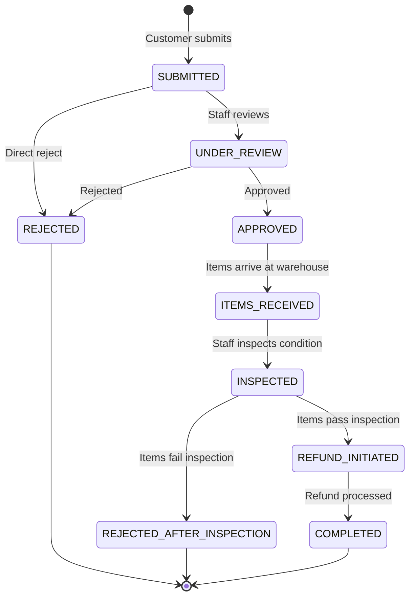
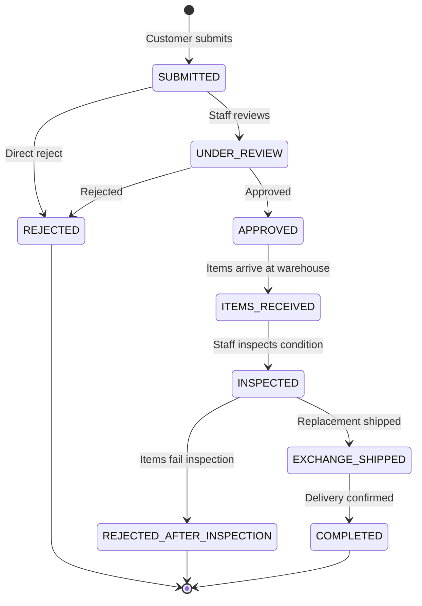

# Aurora Blings — Returns & Exchanges System

## State Machines

### Return Request Lifecycle



### Exchange Request Lifecycle



## Policy Validation

Three checks run when a return/exchange is submitted:

| Check | Rule |
|---|---|
| **Order status** | Must be in `eligible_order_statuses` (default: `["delivered","completed"]`) |
| **Time window** | `now ≤ delivered_at + max_return_days` (default: 7d return, 14d exchange) |
| **Non-returnable** | No item can belong to a category in `non_returnable_category_ids` |

Policy is DB-configured via [ReturnPolicy](file:///f:/Development/Django/aurorablings/backend/apps/returns/models.py#140-196) (singleton, admin-editable).  
Per-category overrides can be specified in the `category_overrides` JSON field.

## Refund Calculation (per item, post-inspection)

| Condition on Receipt | Refund |
|---|---|
| `good` | `unit_price × qty × (1 - restocking_fee_pct/100)` |
| `minor_damage` | same as `good` (full minus restocking fee) |
| `damaged` | 50% of item value |
| `missing_parts` | 50% of item value |
| `unusable` | ₹0 (no refund) |

`restocking_fee_pct` is configured on [ReturnPolicy](file:///f:/Development/Django/aurorablings/backend/apps/returns/models.py#140-196) (default: 0%).

## Stock Reintegration

```
inspect_return_items()
  ├─ condition = good / minor_damage → inventory.process_return(return_to_stock=True)
  │                                     → on_hand + qty, RETURN ledger entry
  └─ condition = damaged / unusable  → inventory.process_return(return_to_stock=False)
                                        → DAMAGE quarantine ledger entry (no stock change)

inspect_exchange_items()
  → inventory.process_exchange()
    ├─ outgoing_variant (replacement to customer) → on_hand - qty, EXCHANGE_OUT ledger
    └─ incoming_variant (customer returns original) → on_hand + qty, EXCHANGE_IN ledger
```

## Reason Codes

| Code | Label |
|---|---|
| `defective` | Product is defective / not working |
| `damaged_transit` | Damaged during shipping |
| `wrong_item` | Wrong item sent |
| `not_as_described` | Not as described / pictured |
| `changed_mind` | Changed my mind |
| `size_issue` | Size / fit issue |
| `quality_issue` | Quality not satisfactory |
| `duplicate_order` | Ordered by mistake / duplicate |
| `late_delivery` | Delivered too late |
| `other` | Other |

## Numbering

| Type | Format | Example |
|---|---|---|
| Return | `RET-YYYY-NNNNN` | `RET-2026-00001` |
| Exchange | `EXC-YYYY-NNNNN` | `EXC-2026-00001` |

## API Endpoint Reference

### Customer Endpoints
| Method | URL | Description |
|---|---|---|
| `POST` | `/api/v1/returns/` | Submit return request |
| `GET` | `/api/v1/returns/` | My returns |
| `GET` | `/api/v1/returns/{id}/` | Return detail |
| `POST` | `/api/v1/returns/exchanges/` | Submit exchange request |
| `GET` | `/api/v1/returns/exchanges/` | My exchanges |
| `GET` | `/api/v1/returns/exchanges/{id}/` | Exchange detail |
| `GET` | `/api/v1/returns/policy/` | View return policy |

### Admin Return Endpoints (staff+)
| Method | URL | Action |
|---|---|---|
| `GET` | `/api/v1/returns/admin/` | All returns (filterable) |
| `POST` | `/api/v1/returns/admin/{id}/approve/` | Approve |
| `POST` | `/api/v1/returns/admin/{id}/reject/` | Reject |
| `POST` | `/api/v1/returns/admin/{id}/receive/` | Mark items received |
| `POST` | `/api/v1/returns/admin/{id}/inspect/` | Set item conditions + calc refund |
| `POST` | `/api/v1/returns/admin/{id}/reintegrate-stock/` | Push back to inventory |
| `POST` | `/api/v1/returns/admin/{id}/initiate-refund/` | Mark refund initiated |
| `POST` | `/api/v1/returns/admin/{id}/complete/` | Complete |
| `POST` | `/api/v1/returns/admin/{id}/reject-inspection/` | Reject post-inspection |

### Admin Exchange Endpoints (staff+)
| Method | URL | Action |
|---|---|---|
| `GET` | `/api/v1/returns/exchanges/admin/` | All exchanges |
| `POST` | `/api/v1/returns/exchanges/admin/{id}/approve/` | Approve |
| `POST` | `/api/v1/returns/exchanges/admin/{id}/reject/` | Reject |
| `POST` | `/api/v1/returns/exchanges/admin/{id}/receive/` | Receive items |
| `POST` | `/api/v1/returns/exchanges/admin/{id}/inspect/` | Inspect items |
| `POST` | `/api/v1/returns/exchanges/admin/{id}/reintegrate-stock/` | Reintegrate stock |
| `POST` | `/api/v1/returns/exchanges/admin/{id}/ship/` | Ship replacement |
| `POST` | `/api/v1/returns/exchanges/admin/{id}/complete/` | Complete |

## Migration command
```bash
python manage.py makemigrations returns
python manage.py migrate
```
